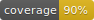

# hello_world

This is an example gem that aims to demonstrate Ruby Gem integration with Bazel and Monorepo.

As a gem, it offers both the Ruby API, as well as the CLI command installed with the gem:


## USAGE

### CLI Usage

```
❯ hello-world  -h

DESCRIPTION
  Prints Hello World in one of the 74 languages.

  Language argument can be a substring. The first language starting with it is used.

USAGE
  hello-world language
  hello-world [ options ]

EXAMPLES
  hello-world -L
  hello-world english
  hello-world eng
  hello-world en
  hello-world spa
  hello-world spanish

OPTIONS
    -L, --list                       Print the languages supported by the gem
    -h, --help                       Prints this help

```

## Installation

To install this gem from the sources:

```bash
git clone <monorepo-url>.git
cd examples/gems/hello_world
gem install bundler
bundle check || bundle install
bundle exec rake install # this installs the gem locally
```

## Usage

```bash
hello_world --help
```

Provides enough information on the CLI usage.

## License

© 2018-2019 Konstantin Gredeskoul & Bazel-Ruby Authors

Licensed under the Apache License, Version 2.0 (the "License"); you may not use this file except in compliance with the License. You may obtain a copy of the License at

<http://www.apache.org/licenses/LICENSE-2.0>

Unless required by applicable law or agreed to in writing, software distributed under the License is distributed on an "AS IS" BASIS,
WITHOUT WARRANTIES OR CONDITIONS OF ANY KIND, either express or implied. See the License for the specific language governing permissions and limitations under the License.
